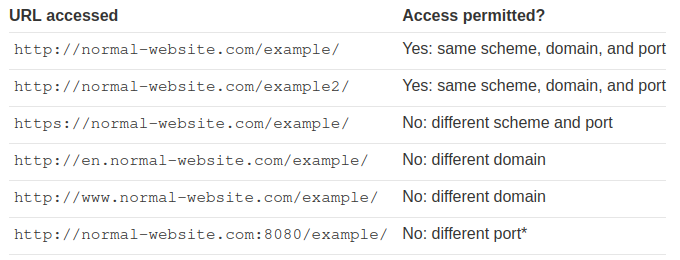

# CORS

## Что такое CORS

Cross-origin resource sharing (CORS) - это механизм браузера, который обеспечивает контролируемый доступ к ресурсам, расположенным за пределами определенного домена. Он расширяет и добавляет гибкости same-origin policy (SOP). Однако он также создает потенциал для междоменных атак, если политика CORS на сайте плохо настроена и реализована. CORS не является защитой от междоменных атак, таких как подделка межсайтовых запросов (CSRF)

## Same-origin policy

Same-origin policy (SOP) - это механизм безопасности веб-браузера, направленный на предотвращение атак веб-сайтов друг на друга. Это ограничительная междоменная спецификация, которая ограничивает возможность веб-сайта взаимодействовать с ресурсами за пределами исходного домена. Обычно она позволяет домену отправлять запросы другим доменам, но не получать доступ к ответам.

SOP ограничивает доступ скриптов одного происхождения к данным другого происхождения. Происхождение состоит из схемы URI, домена и номера порта. Например, рассмотрим следующий URL:

```
http://normal-website.com/example/example.html
```

Здесь используется схема `http`, домен `normal-website.com` и номер порта `80`. В следующей таблице показано, как будет применяться SOP, если содержимое вышеуказанного URL пытается получить доступ к другим источникам:


\*Internet Explorer разрешит этот доступ, потому что IE не учитывает номер порта при применении политики одинакового происхождения

### Почему SOP необходима?

Когда браузер отправляет HTTP-запрос от одного источника к другому, любые куки, включая куки сеанса аутентификации, относящиеся к другому домену, также отправляются как часть запроса. Это означает, что ответ будет сформирован в рамках сессии пользователя и будет включать любые данные, относящиеся к данному пользователю. Без SOP, если бы вы посетили вредоносный веб-сайт, он смог бы прочитать вашу электронную почту из GMail, личные сообщения из Facebook и т.д.

### Как реализована SOP?

SOP обычно контролирует доступ, который код JavaScript имеет к содержимому, загружаемому между доменами. Как правило, разрешена загрузка ресурсов страницы из разных источников. Например, SOP позволяет встраивать изображения с помощью тега ``, медиафайлы с помощью тега `<video>`, а JavaScript включает с помощью тега `<script>`. Однако, хотя эти внешние ресурсы могут быть загружены страницей, любой JavaScript на странице не сможет прочитать содержимое этих ресурсов.

Существуют различные исключения из SOP:
- Некоторые объекты доступны для записи, но не доступны для чтения в разных доменах, например, объект `location` или свойство `location.href` из iframe или новых окон
- Некоторые объекты доступны для чтения, но не доступны для записи, например, свойство `length` объекта `window` (которое хранит количество кадров, используемых на странице) и свойство `closed`
- Функция `replace`, как правило, может быть вызвана кросс-доменным способом на объекте `location`
- Некоторые функции можно вызывать кросс-доменным способом. Например, вы можете вызвать функции `close`, `blur` и `focus` в новом окне. Функция `postMessage` также может быть вызвана на iframe и новых окнах для отправки сообщений из одного домена в другой

В силу легаси требований, SOP является более мягкой при работе с файлами cookie, поэтому они часто доступны со всех поддоменов сайта, даже если каждый поддомен технически имеет другое происхождение. Вы можете частично снизить этот риск, используя флаг cookie `HttpOnly`

Ослабить SOP можно с помощью `document.domain`. Это специальное свойство позволяет ослабить SOP для определенного домена, но только если он является частью вашего FQDN (fully qualified domain name, полностью определенного доменного имени). Например, у вас может быть домен `marketing.example.com`, и вы хотите прочитать содержимое этого домена на `example.com`. Для этого оба домена должны установить `document.domain` на `example.com`. Тогда SOP разрешит доступ между двумя доменами, несмотря на их различное происхождение. В прошлом можно было установить `document.domain` в TLD, например, `com`, что позволяло доступ между любыми доменами на том же TLD, но теперь современные браузеры предотвращают это

## Ослабление SOP

SOP является очень строгой, поэтому были разработаны различные подходы для обхода ограничений. Многие веб-сайты взаимодействуют с поддоменами или сторонними сайтами таким образом, что требуется полный кросс-оригинальный доступ. Контролируемое ослабление политики одноименного доступа возможно с помощью CORS

Протокол CORS использует набор HTTP-заголовков, которые определяют доверенные веб-источники и связанные с ними свойства, например, разрешен ли аутентифицированный доступ. Они объединяются в заголовках, обменивающихся между браузером и веб-сайтом с перекрестным происхождением, к которому он пытается получить доступ

Спецификация CORS обеспечивает контролируемое ослабление политики одинакового происхождения для HTTP-запросов к одному домену веб-сайта от другого с помощью набора HTTP-заголовков. Браузеры разрешают доступ к ответам на кросс-оригинальные запросы на основе инструкций этих заголовков

### Access-Control-Allow-Origin response header

Заголовок `Access-Control-Allow-Origin` включается в ответ одного сайта на запрос, исходящий с другого сайта, и определяет разрешенное происхождение запроса. Веб-браузер сравнивает Access-Control-Allow-Origin с происхождением запрашивающего сайта и разрешает доступ к ответу, если они совпадают.

### Реализация простого CORS

Спецификация CORS предписывает содержимое заголовков, которыми обмениваются веб-серверы и браузеры и которые ограничивают происхождение запросов веб-ресурсов за пределами домена происхождения. Спецификация CORS определяет набор протокольных заголовков, среди которых наиболее значимым является `Access-Control-Allow-Origin`. Этот заголовок возвращается сервером, когда веб-сайт запрашивает междоменный ресурс, а заголовок `Origin` добавляется браузером

Например, предположим, что веб-сайт с происхождением `normal-website.com` вызывает следующий междоменный запрос:

```http
GET /data HTTP/1.1
Host: robust-website.com
Origin : https://normal-website.com
```

Сервер на сайте `robust-website.com` возвращает следующий ответ:
```http
HTTP/1.1 200 OK
...
Access-Control-Allow-Origin: https://normal-website.com
```

Браузер позволит коду, запущенному на `normal-website.com`, получить доступ к ответу, поскольку происхождение совпадает

Спецификация `Access-Control-Allow-Origin` допускает множественное происхождение, или значение `null`, или подстановочный знак `*`. Однако ни один браузер не поддерживает множественное происхождение, и существуют ограничения на использование подстановочного знака `*`

### Обработка междоменных запросов ресурсов с кредами

По умолчанию при междоменных запросах ресурсов запросы передаются без учетных данных, таких как cookies и заголовок `Authorization`. Однако кросс-доменный сервер может разрешить чтение ответа, если ему переданы учетные данные, установив заголовок CORS` Access-Control-Allow-Credentials` в `true`. Теперь, если запрашивающий сайт использует JavaScript, чтобы объявить, что он отправляет cookies вместе с запросом:

```http
GET /data HTTP/1.1
Host: robust-website.com
...
Origin: https://normal-website.com
Cookie: JSESSIONID=<value>
```

И ответ на запрос:

```http
HTTP/1.1 200 OK
...
Access-Control-Allow-Origin: https://normal-website.com
Access-Control-Allow-Credentials: true
```

То браузер разрешит запрашивающему сайту прочитать ответ, поскольку заголовок ответа `Access-Control-Allow-Credentials` имеет значение `true`. В противном случае браузер не разрешит доступ к ответу

### Ослабление спецификаций CORS с помощью подстановочных знаков

Заголовок `Access-Control-Allow-Origin` поддерживает подстановочные знаки. Например:

```
Access-Control-Allow-Origin: *
```

Примечание:
>Обратите внимание, что подстановочные знаки не могут быть использованы внутри любого другого значения. Например, следующий заголовок **не** действителен: `Access-Control-Allow-Origin: https://*.normal-website.com`

К счастью, с точки зрения безопасности, использование подстановочного знака ограничено в спецификации, поскольку вы не можете сочетать подстановочный знак с междоменной передачей учетных данных (аутентификация, куки или сертификаты на стороне клиента). Следовательно, междоменный ответ сервера вида:

```
Access-Control-Allow-Origin: *
Access-Control-Allow-Credentials: true
```

не допускается, так как это было бы опасно небезопасно и открывало бы любой аутентифицированный контент на целевом сайте для всех.

Учитывая эти ограничения, некоторые веб-серверы динамически создают заголовки `Access-Control-Allow-Origin` на основе указанного клиентом происхождения. Это обходной путь для ограничений CORS, который не является безопасным

### Pre-flight проверки

Проверка pre-flight (`pre-flight check`) была добавлена в спецификацию CORS для защиты легаси ресурсов от расширенных опций запроса, разрешенных CORS. При определенных обстоятельствах, когда междоменный запрос включает нестандартный метод HTTP или заголовки, междоменному запросу предшествует запрос с использованием метода `OPTIONS`, и протокол CORS требует первоначальной проверки того, какие методы и заголовки разрешены, прежде чем разрешить междоменный запрос. Это называется pre-flight проверкой. Сервер возвращает список разрешенных методов в дополнение к доверенному происхождению, а браузер проверяет, разрешен ли метод запрашивающего сайта.

Например, это предполетный запрос, который пытается использовать метод `PUT` вместе с пользовательским заголовком запроса под названием `Special-Request-Header`:

```http
OPTIONS /data HTTP/1.1
Host: <some website>
...
Origin: https://normal-website.com
Access-Control-Request-Method: PUT
Access-Control-Request-Headers: Special-Request-Header
```

Сервер может вернуть ответ, подобный следующему:

```http
HTTP/1.1 204 No Content
...
Access-Control-Allow-Origin: https://normal-website.com
Access-Control-Allow-Methods: PUT, POST, OPTIONS
Access-Control-Allow-Headers: Special-Request-Header
Access-Control-Allow-Credentials: true
Access-Control-Max-Age: 240
```

Этот ответ определяет разрешенные методы (`PUT`, `POST` и `OPTIONS`) и разрешенные заголовки запроса (`Special-Request-Header`). В данном конкретном случае междоменный сервер также разрешает отправку учетных данных, а заголовок `Access-Control-Max-Age` определяет максимальный срок кэширования pre-flight ответа для повторного использования. Если методы запроса и заголовки разрешены (как в данном примере), то браузер обрабатывает междоменный запрос обычным образом. Pre-flight проверки добавляют дополнительный цикл HTTP-запроса к междоменному запросу (~~бд с логами скажут: спасибо, вкусно поели~~)

### Защищает ли CORS от CSRF?

CORS не обеспечивает защиту от атак подделки межсайтовых запросов (CSRF), это распространенное заблуждение.

CORS - это контролируемое ослабление политики same-origin, поэтому плохо настроенный CORS может фактически увеличить вероятность атак CSRF или усугубить их последствия.

Существуют различные способы проведения CSRF-атак без использования CORS, включая простые HTML-формы и междоменные включения ресурсов.

## Уязвимости, возникающие из-за мисконфигураций CORS

## Как предотвратить CORS-based атаки